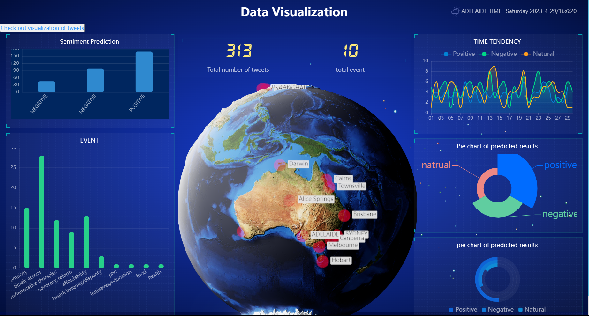
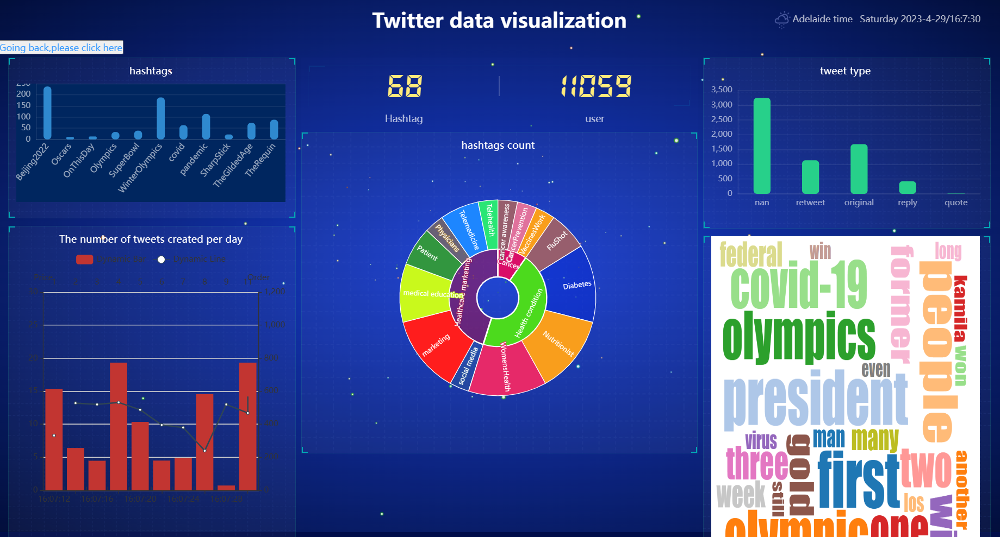

# this is a twitter visualizaion flask app 


# Installation

```
pip install flask
```

# To run it

```
python app.py;
```

* main twitter visualizaiton http://127.0.0.1:5000/        
 

* sub-page http://127.0.0.1:5000/job    

# examples





